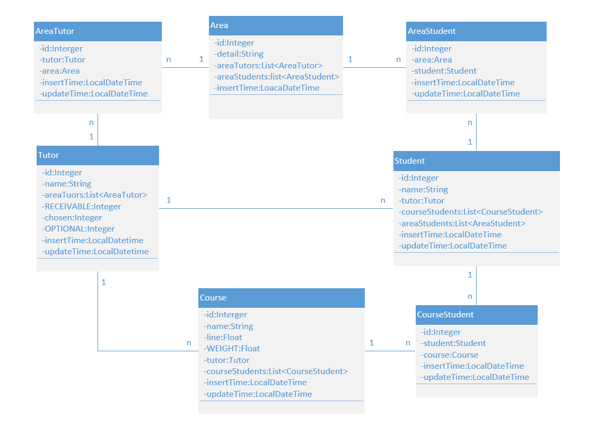

# 项目描述
目的：为毕业生选择老师进行毕业设计提供平台。  

# 项目环境
* idea19.3.3
* springboot 2.2.5
* mysql 8.0
* Vue x

***

## 2020.03.10
项目初始化完成

## 2020.03.12
第一次实体类书写完成

## 2020.03.17
修改实体类
Tutor添加password属性，Student id属性去掉自增长;
编写基本repository接口

## 2020.03.19
实体类第四次修改

修改实体类，每个实体类添加插入时间戳和修改时间戳。  
修改实体类名，将AT类修改为AreaTutor等。
去掉AreaTutor类的WEIGHT（权重）属性
添加StudentService类
和TutorService类及其部分方法
    
## 2020.03.28
### 进度  
完成tutorService六成左右的开发，根据老师的建议，将方法的返回值进行了修改    
修改实体类，在Area，Course，Student，Tutor类上添加级联删除
### 问题 1
无法通过输入导师（tutor）id查询他所有的方向（area），目前以为是  
@Query("from Area a where a.id in (select at.id from AreaTutor at where at.tutor.id=:tutorId)")  
但是返回值为空数组；  
#### 问题已解决
不知道怎么解决的，睡一觉就好了，也不用改代码，估计是需要重启或者别的什么
### 问题2
控制层与Service层对接失败，正在寻找原因，估计还是像以前一样落下了哪个步骤    

    